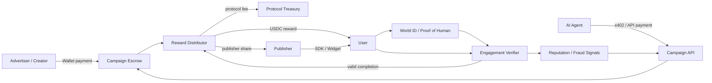
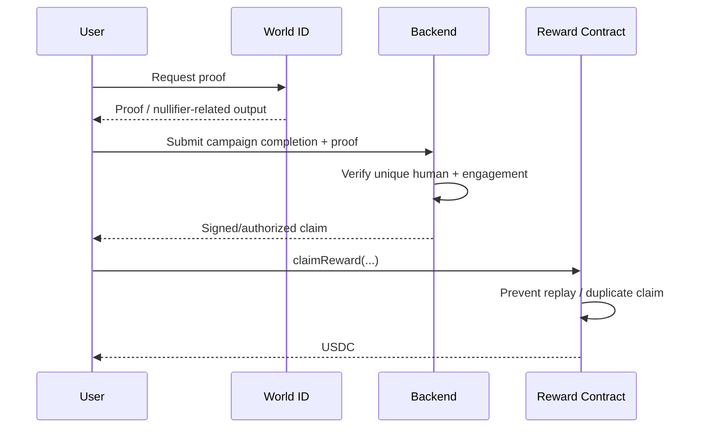

# Verified Human Attention Market

[English](README.md) | [繁體中文](README.zh-TW.md)

[Roadmap](#roadmap)

> Working title. A Web3 marketplace/protocol for buying **verified human attention** and rewarding real users in **USDC**.

This repository is the product and engineering master plan for turning the idea from a proof of concept into a production system.

The core thesis is simple:

> **Do not build a “watch ads to earn crypto” website. Build a market and protocol for verifiable human attention.**

The protocol should let advertisers, creators, publishers, and AI agents fund campaigns; let verified humans complete meaningful missions; and settle rewards transparently.

## SDLC Status

**Current phase:** Planning → Requirements

**Implementation:** Not started

The first SDLC artifacts are now maintained in the repository:

- [SDLC status](docs/SDLC_STATUS.md)
- [Product brief](docs/product/PRODUCT_BRIEF.md)
- [MVP requirements](docs/product/REQUIREMENTS.md)
- [MVP architecture](docs/architecture/MVP_ARCHITECTURE.md)
- [ADR-0001: Base as proposed MVP chain](docs/adr/0001-mvp-chain-base.md)
- [ADR-0002: Sponsored content + comprehension check](docs/adr/0002-first-use-case-sponsored-content.md)
- [Threat model v0](docs/threat-model/THREAT_MODEL.md)

Working assumptions are intentionally reversible until the Product Decision Gate is accepted.

---

## 1. Problem

Digital advertising has several structural problems:

- advertisers pay for impressions/clicks that may be generated by bots, farms, or low-quality traffic;
- users provide attention but usually receive none of the economic value;
- advertisers cannot easily purchase a small amount of verifiable, high-quality human engagement through an API;
- Web3 campaigns often rely on wallet activity as a proxy for “real user,” which does not prove unique humanity;
- “proof that someone is human” and “proof that someone actually engaged” are different problems.

This project separates those problems and solves them with different layers.

---

## 2. Product Positioning

**Verified Human Attention Marketplace**

The platform is a two-sided market plus an integration protocol.

| Actor | What they want | What the platform provides |
| --- | --- | --- |
| Advertiser / Creator | Real human attention and measurable outcomes | Verified-human targeting, escrow, analytics |
| User | Compensation for attention, feedback, or actions | USDC rewards, preferences, reputation |
| Publisher | Monetize existing traffic | SDK / widget / API and revenue share |
| AI Agent | Programmatic access to real humans | API-first campaign creation and machine payments |

The long-term product is not only a website. The website is one client of the protocol.

---

## 3. Core Design Principles

1. **Single-chain first.** Do not introduce cross-chain complexity before product-market need exists.
2. **Identity and engagement are separate.** World ID can help prove unique humanity; it cannot prove that the user paid attention.
3. **USDC is the settlement asset.** Avoid launching a speculative native token for the MVP.
4. **Smart contracts handle escrow and rewards.** Off-chain services handle flexible engagement verification and analytics.
5. **x402 belongs on the machine/API payment side.** It is not a click-to-earn protocol.
6. **AARC is optional infrastructure for later chain abstraction.** It should not be an MVP dependency.
7. **Every interaction should accumulate defensible network value:** reputation, fraud signals, advertiser workflow integrations, publisher distribution, and market liquidity.

---

## 4. System Overview



### Layer responsibilities

| Layer | Responsibility |
| --- | --- |
| World ID / Proof of Human | Unique-human / anti-Sybil signal |
| Engagement verifier | Whether a campaign mission was actually completed |
| Smart contracts | Budget escrow, accounting, claims, refunds, fees |
| USDC | Settlement |
| x402 | Machine/API payment path for agents and automated clients |
| AARC | Future chain abstraction / cross-chain UX if needed |
| Backend | Campaign orchestration, analytics, fraud detection, attestations |
| Frontend | Advertiser dashboard, user mission feed, publisher integration UI |

---

## 5. Why x402 Is Useful — and Where It Is Not

x402 should be treated as a **payment mechanism for HTTP/API resources**, especially when the payer is software.

Good use cases:

- an AI agent pays to create or fund a campaign;
- an AI agent purchases access to a verified-human response API;
- a publisher or partner pays for a metered API;
- machine-to-machine workflows need automated settlement.

Do **not** make x402 responsible for:

- determining whether a user is human;
- deciding whether a click is valid;
- reward accounting;
- campaign escrow;
- paying the user merely because a page was clicked.

A human advertiser can still use x402, but a normal wallet checkout may be the simpler UX. x402 becomes strategically important when the same product is exposed to autonomous agents and external software.

---

## 6. World ID / Proof of Human

World ID is a candidate identity layer for proving that a claimant is a unique human without requiring the protocol to build its own identity network.

A target claim flow:



### Important distinction

**Proof of Human != Proof of Engagement.**

A verified human can still:

- instantly close the content;
- randomly answer a quiz;
- mechanically farm campaigns;
- coordinate with other humans;
- submit low-quality feedback.

World ID is therefore one anti-Sybil input, not the entire fraud system.

---

## 7. Engagement Verification

The first production advantage should come from better measurement of **quality**, not from adding more chains.

Possible mission types:

- read an article;
- watch content;
- try a dApp;
- complete a survey;
- answer comprehension questions;
- perform a testnet/mainnet action;
- join a beta program;
- submit structured feedback;
- compare two product experiences;
- complete a research task.

Possible quality signals:

- active dwell time;
- completion percentage;
- interaction events;
- comprehension score;
- task-specific on-chain evidence;
- advertiser acceptance/rejection;
- repeated behavioral patterns;
- historical completion quality;
- fraud-risk score.

Do not rely on a single signal such as dwell time. It is easy to game.

---

## 8. Reputation

The platform should build **pseudonymous behavioral reputation**, not necessarily expose real-world identity.

A reputation profile may include:

- campaign completion rate;
- accepted completion rate;
- average comprehension score;
- consistency across missions;
- response quality;
- dispute frequency;
- suspicious-behavior score;
- domain-specific experience.

Conceptually:

```
Verified Human
    +
Behavioral Reputation
    +
Campaign Context
    =
Priced Attention Quality
```

The reputation system is one of the major long-term moats because a competitor can copy code but cannot instantly reproduce historical quality data.

---

## 9. Payment and Chain Strategy

### MVP recommendation

Start with **one EVM-compatible chain** and native/officially supported USDC on that chain.

Candidate environments include:

- **Base** — strong fit for USDC, EVM tooling, API/agent payment experiments;
- **World Chain** — attractive if the product becomes deeply centered on the World ecosystem and verified humans.

The final chain choice should be made after validating:

- current USDC support;
- World ID integration path;
- transaction cost;
- smart-contract tooling;
- user wallet UX;
- x402 ecosystem support;
- operational reliability.

### Do not build cross-chain in the MVP

Cross-chain introduces additional:

- bridge risk;
- failure states;
- liquidity assumptions;
- monitoring requirements;
- support burden;
- smart-contract attack surface.

A user should not have to understand bridging merely to earn a small campaign reward.

---

## 10. AARC

AARC is a **candidate future chain-abstraction layer**, not a core protocol dependency for the first release.

Potential future use cases:

- advertiser funds exist on a different chain from campaign settlement;
- users want rewards on different chains;
- the system expands to multiple EVM networks;
- bridge/swap/gas details should be hidden from the end user;
- the product wants a chain-agnostic funding UX.

Proposed evolution:

```
Phase 1: Single-chain EVM
Phase 2: Multi-chain demand appears
Phase 3: Integrate AARC / chain abstraction
Phase 4: Chain becomes an implementation detail for users
```

Before implementation, validate AARC's current SDK, supported networks, security model, fees, and integration constraints.

---

## 11. Smart Contract Scope

Keep contracts intentionally small.

### Candidate contracts

```
CampaignFactory
CampaignEscrow
RewardDistributor
FeeRouter
```

A minimal campaign model:

```solidity
struct Campaign {
    address advertiser;
    address rewardToken;
    uint256 budget;
    uint256 rewardPerCompletion;
    uint64 startTime;
    uint64 endTime;
    uint32 maxParticipants;
    CampaignStatus status;
}
```

Candidate operations:

```
createCampaign()
fundCampaign()
authorizeClaim()
claimReward()
closeCampaign()
withdrawUnusedBudget()
```

### Contract invariants

At minimum:

- rewards + fees + remaining balance must never exceed funded budget;
- a claim cannot be replayed;
- one campaign eligibility proof cannot be reused by the same user;
- closed/expired campaigns cannot create new liabilities;
- unused budget has a deterministic refund path;
- protocol fee accounting must be auditable.

---

## 12. Off-chain vs On-chain Boundary

Not everything belongs on-chain.

### On-chain

- campaign funding;
- escrow;
- payout;
- fee accounting;
- immutable settlement events;
- replay protection;
- campaign lifecycle state that affects funds.

### Off-chain

- content delivery;
- dwell/activity telemetry;
- anti-fraud models;
- reputation computation;
- advertiser analytics;
- mission rules that change frequently;
- moderation;
- indexing.

For early releases, the backend may authorize claims with signed attestations. Production design should ensure that compromise of one service cannot drain arbitrary escrow funds.

---

## 13. Business Model

Possible revenue streams:

1. percentage fee on funded/settled campaign value;
2. fee per verified completion;
3. premium audience targeting;
4. analytics subscription;
5. API/Agent access;
6. publisher revenue-share spread;
7. enterprise fraud / verified-human API.

Avoid optimizing too early for token economics. A simple USDC-denominated business is easier to validate.

---

## 14. Distribution Strategy

The strongest version of the product should not require all users to visit one website.

### Publisher SDK

Allow other sites, apps, games, blogs, and dApps to embed campaigns.

Possible integration surfaces:

```
<VerifiedMission campaign="..." />
```

or:

```
POST /v1/missions/match
POST /v1/completions
GET  /v1/campaigns/:id
```

A publisher network creates distribution that is significantly harder to replicate than a standalone UI.

---

## 15. AI Agent Strategy

AI agents can become a distinct demand-side customer.

Example:

1. an agent determines that it needs 100 verified human judgments;
2. it calls the platform API;
3. payment is handled programmatically via x402 or another supported machine-payment path;
4. a campaign is created;
5. verified users complete the task;
6. the agent retrieves structured responses.

Long-term positioning can therefore extend beyond advertising:

> **Verified Human Attention as an API**

Potential demand:

- market research;
- human evaluation for AI;
- preference collection;
- product testing;
- human-in-the-loop verification;
- community discovery.

---

## 16. Moat

User habit alone is a weak moat. A funded incumbent can subsidize switching.

The defensible assets should be:

### 16.1 Reputation data

Historical verified-human quality and fraud signals.

### 16.2 Market liquidity

Enough demand and supply that campaigns fill quickly at predictable prices.

### 16.3 Publisher distribution

Third-party websites and apps embed the protocol.

### 16.4 Workflow integration

Advertisers and agents build the API into production workflows.

### 16.5 Fraud intelligence

Attack patterns and detection data improve with scale.

### 16.6 Trust

Reliable settlement, dispute handling, privacy, and security become brand assets.

A large company can copy the frontend and contracts. It cannot instantly copy the network state accumulated across these dimensions.

---

## 17. Threat Model

Production planning must assume adversarial users.

Key threats:

- Sybil accounts;
- replayed identity proofs;
- duplicate claims;
- scripted engagement;
- human farming;
- advertiser-created malicious content;
- publisher attribution fraud;
- compromised backend claim signer;
- oracle/attestation manipulation;
- smart-contract reentrancy or accounting bugs;
- fake campaigns / phishing;
- privacy leakage from identity + behavioral data;
- wash activity designed to manufacture reputation.

Security requirements should be defined before adding financial scale.

---

## 18. Privacy Principles

Proof of humanity should not become a surveillance identity graph.

Principles:

- collect the minimum data necessary;
- keep real-world identity separate from campaign behavior;
- use campaign-scoped or privacy-preserving identifiers where possible;
- avoid publicly exposing a user's full history;
- define retention periods for telemetry;
- make consent explicit for analytics and research data;
- threat-model deanonymization across campaigns.

---

# SDLC Plan

The project should use a normal **Software Development Life Cycle (SDLC)** inside each product stage.

```
Planning
   ↓
Requirements
   ↓
System Design
   ↓
Implementation
   ↓
Testing
   ↓
Deployment
   ↓
Operations & Maintenance
   ↺
```

Separately, the product evolves through:

```
POC → MVP → Beta → Production → Protocol / Ecosystem
```

These are two different dimensions: **SDLC describes how each release is built; the product roadmap describes what maturity level is being built.**

---

## 19. SDLC Phase 1 — Planning

### Questions

- Who is the first paying customer?
- Is the first use case advertising, product research, or human evaluation?
- What constitutes a valid completion?
- What is the initial reward size?
- Which single chain will be used?
- Which party absorbs gas?
- What information must remain private?

### Deliverables

- product brief;
- target persona;
- first mission type;
- architecture decision records (ADRs);
- initial legal/compliance review;
- threat model v0.

### Exit criteria

A developer should be able to explain the complete first-user flow without unresolved payment or identity assumptions.

---

## 20. SDLC Phase 2 — Requirements

### MVP functional requirements

- advertiser connects wallet;
- advertiser creates campaign;
- advertiser deposits USDC;
- user verifies unique-human eligibility;
- user completes one mission type;
- backend validates completion;
- user claims reward;
- advertiser sees basic results;
- unused campaign funds can be recovered safely.

### Non-functional requirements

- no duplicate payout;
- deterministic budget accounting;
- mobile-compatible user flow;
- observable transaction failures;
- privacy-sensitive identity storage;
- testable smart-contract invariants.

### Exit criteria

Each requirement has an acceptance test.

---

## 21. SDLC Phase 3 — System Design

Produce:

- contract interfaces;
- database schema;
- API specification;
- identity flow;
- claim authorization design;
- sequence diagrams;
- monitoring plan;
- key management model;
- failure/retry strategy.

### Architecture decision

For the MVP:

```
Frontend:     Next.js / React
Wallet:       EVM wallet stack
Identity:     World ID
Settlement:   USDC
Chain:        one EVM chain
Contracts:    Solidity
Backend:      TypeScript service
Database:     PostgreSQL
Indexing:     event indexer
Agent pay:    x402 added after core claim path works
Cross-chain:  none
```

---

## 22. SDLC Phase 4 — Implementation

Suggested implementation order:

1. repository / CI skeleton;
2. local contract environment;
3. CampaignFactory;
4. CampaignEscrow;
5. USDC test-token funding;
6. reward claim path;
7. World ID integration;
8. one mission type;
9. backend completion verifier;
10. advertiser dashboard;
11. user mission feed;
12. event indexing;
13. analytics;
14. x402 API;
15. publisher SDK;
16. reputation prototype;
17. AARC only after multi-chain demand is validated.

---

## 23. SDLC Phase 5 — Testing

### Smart-contract testing

- unit tests;
- fuzz tests;
- invariant tests;
- boundary timestamps;
- exhausted budgets;
- duplicate claims;
- signer compromise simulations;
- pause/emergency behavior.

### Application testing

- API unit/integration tests;
- identity failure paths;
- wallet rejection;
- RPC outage;
- insufficient funds;
- failed USDC transfer;
- stale campaign state;
- retry/idempotency;
- multi-device user flow.

### Adversarial testing

- scripted clicks;
- automated quiz answering;
- replayed proofs;
- multiple wallets;
- publisher spoofing;
- telemetry forgery.

### Production gate

No mainnet funds until:

- contract invariants pass;
- critical flows have integration tests;
- secrets/key management is reviewed;
- monitoring and pause procedures exist;
- independent contract review/audit is completed for meaningful TVL.

---

## 24. SDLC Phase 6 — Deployment

Deployment progression:

```
Local
  ↓
Testnet
  ↓
Closed Alpha
  ↓
Limited Mainnet Beta
  ↓
Production
```

Start mainnet with:

- capped campaign budgets;
- capped daily payout;
- allowlisted advertisers if needed;
- emergency pause;
- explicit incident runbook.

Do not remove limits simply because the happy-path demo works.

---

## 25. SDLC Phase 7 — Operations & Maintenance

Monitor:

- funded value;
- settled reward value;
- claim success rate;
- fraud rejection rate;
- campaign fill time;
- RPC/API errors;
- signer activity;
- abnormal payout patterns;
- cost per verified engagement.

Operational processes:

- incident response;
- contract upgrade policy;
- dependency updates;
- fraud-rule iteration;
- dispute handling;
- privacy/data deletion process;
- postmortems.

---

# Product Roadmap

## Phase 0 — POC

Goal: prove the full economic loop.

Scope:

- one chain;
- one USDC-like settlement token;
- World ID proof;
- one mission;
- escrow;
- reward claim;
- no cross-chain;
- no complex reputation.

Success means:

> One advertiser can fund a campaign, one unique human can complete it, and the system can safely settle a reward end-to-end.

---

## Phase 1 — MVP

Goal: prove that somebody wants the product.

Add:

- real USDC;
- advertiser dashboard;
- mission feed;
- basic analytics;
- expiration/refund logic;
- basic fraud signals;
- campaign templates.

Primary validation metric:

**Will advertisers repeatedly pay for verified human completions?**

---

## Phase 2 — Beta

Goal: prove repeatability.

Add:

- multiple mission types;
- publisher integration;
- reputation;
- stronger fraud engine;
- dispute workflow;
- API;
- x402 experiment for automated buyers.

Metrics:

- repeat advertiser rate;
- campaign fill time;
- fraud-adjusted cost per valid completion;
- user retention;
- publisher contribution;
- gross margin.

---

## Phase 3 — Production

Goal: operate safely at meaningful value.

Requirements:

- audited contracts;
- mature monitoring;
- access/key controls;
- abuse tooling;
- privacy controls;
- financial reconciliation;
- documented incident response;
- campaign budget caps/risk controls;
- reliable analytics.

---

## Phase 4 — Protocol / Ecosystem

Goal: become infrastructure instead of only an application.

Add:

- public SDK;
- publisher ecosystem;
- agent-native API;
- x402 programmatic demand;
- permissionless integrations;
- third-party mission providers;
- optional multi-chain support;
- AARC / chain abstraction if justified.

---

# Initial Backlog

## P0 — Must have

- [ ] Choose MVP chain
- [ ] Confirm current USDC deployment/support
- [ ] Confirm current World ID integration path
- [ ] Define campaign state machine
- [ ] Implement escrow contract
- [ ] Implement payout/claim contract
- [ ] Implement duplicate-claim protection
- [ ] Build one mission type
- [ ] Build World ID verification flow
- [ ] Build backend completion verifier
- [ ] Build advertiser funding UI
- [ ] Build user claim UI
- [ ] Add contract + integration tests

## P1 — MVP quality

- [ ] Campaign expiration/refund
- [ ] Event indexer
- [ ] Advertiser analytics
- [ ] Basic reputation
- [ ] Basic fraud rules
- [ ] Observability
- [ ] Admin/dispute tooling
- [ ] Privacy/data retention policy

## P2 — Growth

- [ ] Publisher widget/SDK
- [ ] API documentation
- [ ] x402 payment endpoint
- [ ] Agent campaign creation API
- [ ] Mission marketplace
- [ ] More sophisticated reputation
- [ ] Fraud model / anomaly detection

## P3 — Only after evidence of need

- [ ] Multi-chain settlement
- [ ] AARC integration
- [ ] Chain abstraction
- [ ] Cross-chain liquidity management

---

# Suggested Repository Structure

```text
verified-human-attention-market/
├─ README.md
├─ docs/
│  ├─ architecture/
│  ├─ adr/
│  ├─ threat-model/
│  └─ product/
├─ apps/
│  ├─ web/
│  └─ api/
├─ packages/
│  ├─ contracts/
│  ├─ sdk/
│  └─ shared/
├─ tests/
└─ .github/
   └─ workflows/
```

This is a target structure, not a requirement for the first commit.

---

# Key Metrics

Do not optimize for raw clicks.

Prefer:

- cost per **verified valid completion**;
- fraud-adjusted completion rate;
- advertiser repeat rate;
- median campaign fill time;
- accepted completion rate;
- user earnings per active hour;
- publisher-sourced liquidity;
- API/agent-generated demand;
- protocol take rate;
- gross margin after chain/payment costs.

---

# Open Decisions

Before writing production code, resolve these:

1. **First market:** ads, product research, or AI human-evaluation?
2. **MVP chain:** Base or World Chain?
3. **Gas UX:** user pays, advertiser sponsors, or relayer/paymaster?
4. **Claim trust model:** backend-signed attestations vs more decentralized verification?
5. **First mission:** article + comprehension quiz, survey, dApp trial, or another task?
6. **Reward model:** fixed amount, auction, or quality-tiered pricing?
7. **Privacy model:** what reputation is public, private, or selectively disclosed?
8. **Dispute model:** who can reject a completion and under what evidence?
9. **Publisher model:** fixed share or market-based share?
10. **When to introduce x402:** after core MVP or from the first API release?

---

# Current Recommended MVP

If development started today, the narrowest credible MVP would be:

```
Advertiser
  → connects wallet
  → creates campaign
  → deposits USDC

Verified User
  → World ID verification
  → reads content
  → answers a short comprehension check
  → receives authorized claim
  → claims USDC

Protocol
  → prevents duplicate claims
  → records settlement
  → exposes basic campaign analytics
```

**No native token. No DAO. No cross-chain. No AARC in the critical path. No complex ML fraud model yet.**

After this loop demonstrates real demand, expand toward x402 agent buyers, publisher distribution, reputation, and eventually chain abstraction.

---

## Status

**Stage:** Planning / Requirements  
**Target:** POC → MVP  
**Repository:** Product specification and future implementation workspace

---

# Roadmap

This roadmap tracks product maturity from **POC → MVP → Beta → Production → Protocol / Ecosystem**.

It intentionally avoids fixed calendar dates until team capacity and the first target market are decided. Each milestone has explicit deliverables and exit criteria so progress is measured by evidence rather than by feature count.

---

## Roadmap Principles

- **Single-chain first.**
- **USDC before native token.**
- **World ID / Proof of Human is one anti-Sybil layer, not proof of engagement.**
- **x402 is introduced for API/agent payments after the core economic loop works.**
- **AARC / chain abstraction is deferred until real multi-chain demand exists.**
- **No production scaling before financial invariants, monitoring, and incident controls are in place.**
- **Optimize for verified valid completions, not raw clicks.**

---

## Current Status

| Area | Status |
| --- | --- |
| Product thesis | Defined |
| Initial architecture | Defined |
| SDLC | Defined |
| Threat model | Initial |
| MVP chain | Decision required |
| First customer/use case | Decision required |
| Smart contracts | Not started |
| Frontend | Not started |
| Backend | Not started |
| World ID integration | Not started |
| USDC settlement | Not started |
| x402 integration | Deferred |
| AARC integration | Deferred |

Current stage: **Planning / Requirements**

---

# Milestone 0 — Product Decision Gate

## Goal

Freeze the smallest problem worth proving before implementation begins.

## P0 Deliverables

- [ ] Select first customer segment:
  - advertisers / creators;
  - product research teams;
  - AI human-evaluation buyers.
- [ ] Define first mission type.
- [ ] Define what counts as a valid completion.
- [ ] Select MVP chain after checking current integration support.
- [ ] Confirm current USDC deployment/support on the selected chain.
- [ ] Confirm current World ID integration path.
- [ ] Decide gas model.
- [ ] Define first reward model.
- [ ] Define basic privacy/data-retention boundaries.
- [ ] Create ADRs for the major architecture decisions.

## Dependencies

None.

## Exit Criteria

A developer can explain the complete first flow:

> advertiser funds campaign → unique human completes mission → completion is verified → USDC is claimed → unused funds can be recovered

with no unresolved assumptions about identity, settlement, or campaign validity.

---

# Milestone 1 — POC: End-to-End Economic Loop

## Goal

Prove that the economic loop works technically.

## Scope

One chain, one mission, one advertiser, one verified user path.

## P0 Deliverables

### Contracts

- [ ] Campaign state machine.
- [ ] CampaignFactory.
- [ ] CampaignEscrow.
- [ ] Reward claim mechanism.
- [ ] Refund unused budget.
- [ ] Duplicate/replay protection.
- [ ] Contract events for indexing.

### Identity

- [ ] World ID proof flow.
- [ ] Campaign-specific uniqueness strategy.
- [ ] Proof replay handling.

### Backend

- [ ] Create/read campaign API.
- [ ] Completion verification endpoint.
- [ ] Claim authorization path.
- [ ] Idempotent completion handling.

### Frontend

- [ ] Advertiser wallet connection.
- [ ] Create/fund campaign screen.
- [ ] User mission page.
- [ ] World ID verification UX.
- [ ] Claim reward UX.

### Testing

- [ ] Contract unit tests.
- [ ] Basic invariant tests.
- [ ] End-to-end happy path.
- [ ] Duplicate claim test.
- [ ] Expired campaign test.
- [ ] Failed transfer / rejected wallet test.

## Explicitly Out of Scope

- x402;
- AARC;
- multi-chain;
- native token;
- DAO;
- sophisticated reputation;
- ML fraud detection;
- permissionless publisher ecosystem.

## Exit Criteria

On a development environment or testnet:

1. advertiser funds a campaign;
2. an eligible human completes the mission;
3. the system rejects a duplicate claim;
4. the valid claimant receives the expected reward;
5. contract accounting remains correct;
6. advertiser can recover unused budget.

---

# Milestone 2 — MVP: Real Buyer Validation

## Goal

Determine whether a real buyer will repeatedly pay for verified human completions.

## P0 Deliverables

- [ ] Real supported USDC settlement.
- [ ] Campaign expiration/refund.
- [ ] Basic advertiser dashboard.
- [ ] User mission feed.
- [ ] Basic campaign analytics.
- [ ] Event indexing.
- [ ] Mission result storage.
- [ ] Basic fraud rules.
- [ ] Basic reputation fields.
- [ ] Observability for API and blockchain failures.
- [ ] Privacy/data-retention policy.
- [ ] Admin/dispute tooling.

## P1 Deliverables

- [ ] Multiple campaign templates.
- [ ] User preference filters.
- [ ] Basic publisher attribution model.
- [ ] Exportable advertiser results.

## Key Metrics

- cost per verified valid completion;
- advertiser repeat rate;
- accepted completion rate;
- fraud-adjusted completion rate;
- campaign fill time;
- user earnings per active hour.

## Exit Criteria

At least one real buyer demonstrates repeated willingness to fund campaigns, and the product can measure fraud-adjusted unit economics.

---

# Milestone 3 — Closed Beta: Repeatability and Quality

## Goal

Show that the marketplace can operate repeatedly without manual intervention for every campaign.

## Deliverables

### Mission System

- [ ] Multiple mission types.
- [ ] Mission templates.
- [ ] Configurable eligibility and completion rules.
- [ ] Better comprehension / quality checks.

### Reputation

- [ ] Pseudonymous reputation model.
- [ ] Accepted-completion history.
- [ ] Domain/task-specific quality signals.
- [ ] Dispute impact on reputation.
- [ ] Abuse-resistant score update rules.

### Fraud

- [ ] Behavioral anomaly rules.
- [ ] Telemetry forgery detection.
- [ ] Human farming heuristics.
- [ ] Rate limits.
- [ ] Risk review tooling.

### Publisher

- [ ] First embeddable widget or SDK.
- [ ] Publisher attribution.
- [ ] Revenue-share accounting.

### API

- [ ] Stable campaign API.
- [ ] Stable completion/result API.
- [ ] API authentication and rate limits.
- [ ] Versioning policy.

## Exit Criteria

- campaigns can be created, completed, settled, and reported with limited operator intervention;
- fraud can be quantified rather than treated as an unknown;
- at least one external publisher or integration works end to end.

---

# Milestone 4 — Agent-Native Demand / x402

## Goal

Allow software and AI agents to purchase verified human work programmatically.

## Dependencies

- stable campaign API;
- stable settlement;
- reliable fraud controls;
- clear machine-readable task/result schema.

## Deliverables

- [ ] x402 feasibility validation against current ecosystem/specification.
- [ ] Machine-readable campaign creation endpoint.
- [ ] Programmatic payment flow.
- [ ] Agent-friendly task schema.
- [ ] Structured result retrieval.
- [ ] Idempotency and payment reconciliation.
- [ ] Per-agent limits / abuse controls.
- [ ] API documentation and examples.

## Example Target Flow

```
AI Agent
  → requests 100 verified human judgments
  → pays programmatically
  → campaign is created
  → humans complete tasks
  → agent retrieves structured results
```

## Exit Criteria

An external software client can purchase and retrieve verified-human work without a human operator manually funding each campaign.

---

# Milestone 5 — Production Readiness

## Goal

Operate with meaningful real funds and predictable incident handling.

## Smart Contract Security

- [ ] Unit tests.
- [ ] Fuzz tests.
- [ ] Invariant tests.
- [ ] Access-control review.
- [ ] Replay protection review.
- [ ] Budget accounting review.
- [ ] Pause/emergency mechanisms.
- [ ] Independent security review / audit appropriate to TVL.

## Infrastructure

- [ ] Production secrets/key management.
- [ ] Monitoring and alerting.
- [ ] RPC/provider failure handling.
- [ ] Database backup/restore.
- [ ] Queue/retry strategy.
- [ ] Financial reconciliation.
- [ ] Structured logging.
- [ ] On-call / incident process.

## Risk Controls

- [ ] Campaign funding limits.
- [ ] Daily payout limits.
- [ ] Suspicious-payout alerts.
- [ ] Signer anomaly alerts.
- [ ] Emergency pause runbook.
- [ ] Incident postmortem template.

## Privacy / Abuse

- [ ] Data-retention enforcement.
- [ ] User deletion/privacy workflow where applicable.
- [ ] Malicious campaign/content moderation.
- [ ] Phishing/scam controls.
- [ ] Publisher abuse controls.

## Exit Criteria

The platform can survive expected infrastructure failures and has a documented response path for financial/security incidents before limits are raised.

---

# Milestone 6 — Publisher Network

## Goal

Move distribution beyond the first-party website.

## Deliverables

- [ ] Public publisher SDK.
- [ ] Embeddable mission component.
- [ ] Revenue-share rules.
- [ ] Attribution system.
- [ ] Publisher analytics.
- [ ] Integration documentation.
- [ ] Versioned SDK releases.
- [ ] Sandbox environment.

## Exit Criteria

Multiple independent third-party properties can source users and receive auditable revenue share without custom one-off integration work.

---

# Milestone 7 — Protocol / Ecosystem

## Goal

Become infrastructure rather than only an application.

## Deliverables

- [ ] Stable public API.
- [ ] Stable SDK.
- [ ] Permissionless or semi-permissionless campaign integration model.
- [ ] Third-party mission providers.
- [ ] Agent-native demand.
- [ ] Publisher network.
- [ ] Reputation portability policy.
- [ ] Governance/security policy for protocol changes.

## Exit Criteria

A meaningful portion of demand and supply originates outside the first-party UI.

---

# Milestone 8 — Multi-Chain / AARC Decision Gate

## Goal

Add chain abstraction only when the market demonstrates that chain fragmentation is a real problem.

## Trigger Conditions

Proceed only if one or more are true:

- important advertisers hold funds on unsupported chains;
- users materially prefer reward settlement on other chains;
- publisher/agent partners require other networks;
- bridging friction measurably hurts conversion;
- liquidity/fees on the original chain become a material constraint.

## Validation Before Implementation

- [ ] Confirm current AARC SDK/API capabilities.
- [ ] Confirm supported networks.
- [ ] Review security/trust assumptions.
- [ ] Model bridge/swap failure states.
- [ ] Model additional fees.
- [ ] Define fallback and recovery behavior.
- [ ] Decide where canonical campaign accounting lives.

## Deliverables

Only if the decision gate passes:

- [ ] chain abstraction layer;
- [ ] cross-chain funding UX;
- [ ] cross-chain reward UX where justified;
- [ ] liquidity/reconciliation monitoring;
- [ ] cross-chain incident runbook.

## Exit Criteria

Users can interact without needing to understand the underlying chain, while accounting remains deterministic and failure recovery is documented.

---

# Cross-Cutting Workstreams

These run across milestones rather than belonging to only one release.

## Security

- threat model;
- contract invariants;
- key management;
- dependency review;
- incident response.

## Privacy

- data minimization;
- pseudonymous reputation;
- campaign-scoped identifiers;
- retention limits;
- deanonymization analysis.

## Fraud Intelligence

- Sybil signals;
- behavioral signals;
- publisher fraud;
- campaign abuse;
- anomaly datasets.

## Developer Experience

- API docs;
- SDK;
- examples;
- sandbox;
- versioning;
- backward compatibility.

## Market Design

- reward pricing;
- platform take rate;
- publisher share;
- reputation effects;
- dispute incentives.

---

# Priority Model

| Priority | Meaning |
| --- | --- |
| P0 | Required for current milestone / blocks validation |
| P1 | Important for quality and repeatability |
| P2 | Growth feature after core demand is proven |
| P3 | Only after evidence of need |

Current focus should remain on **P0 Milestone 0 → Milestone 1**.

---

# What We Should Not Build Yet

Until the core loop shows real demand:

- native token;
- DAO;
- speculative tokenomics;
- multi-chain settlement;
- AARC in the critical path;
- complex ML fraud scoring;
- fully decentralized engagement verification;
- large publisher marketplace;
- advanced auction/pricing system.

These may become useful later, but they currently add execution risk without validating the central hypothesis.

---

# Definition of Success

The first major proof point is not TVL, token price, or raw clicks.

It is:

> **A real buyer repeatedly pays for fraud-adjusted, verified-human completions because the output is more useful than conventional unverified traffic.**

Everything in the roadmap should support or test that statement.
