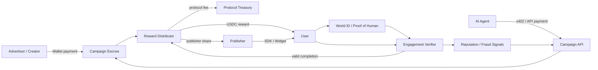
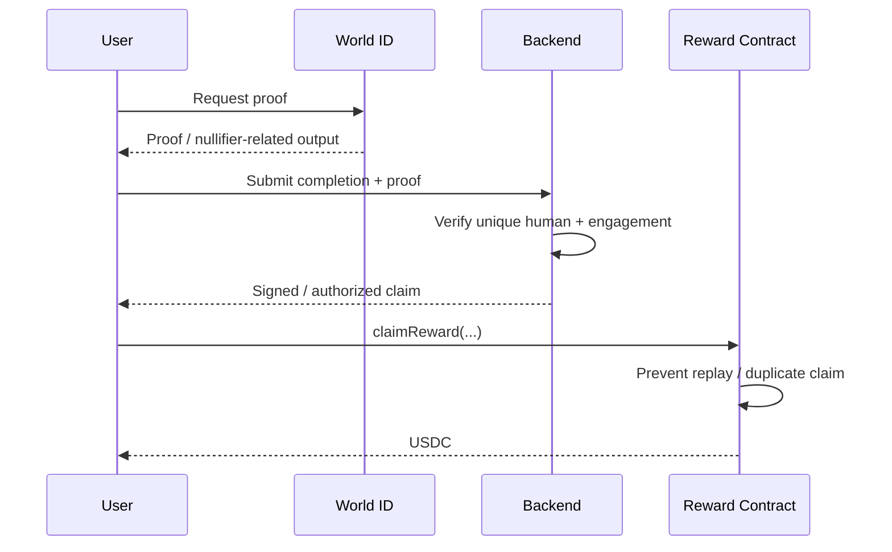

# Verified Human Attention Market

[English](README.md) | [繁體中文](README.zh-TW.md)

[開發路線圖](#開發路線圖)

> 暫定名稱。一個以 **USDC** 結算、讓廣告主／內容方購買「可驗證真人注意力」，並讓真人使用者因完成有效任務而獲得報酬的 Web3 marketplace / protocol。

本 repository 同時作為產品規格、技術設計與 SDLC 主文件，目標是把概念從 POC 推進到可安全營運的 production system。

核心主張：

> **不要只做「看廣告賺幣」網站，而是建立「可驗證真人注意力市場與協議」。**

---

## 1. 要解決的問題

目前數位廣告與 Web3 growth campaign 常見幾個結構性問題：

- 廣告主可能為 bot、click farm 或低品質流量付費；
- 使用者提供注意力，但通常沒有直接取得其經濟價值；
- 廣告主很難透過 API 直接購買少量、高品質、可驗證的真人互動；
- Web3 常用 wallet activity 當作「真人」代理指標，但 wallet 並不等於獨立真人；
- 「證明這是一個真人」與「證明這個真人真的有有效參與」是不同問題。

本專案將這些問題拆成不同層處理，而不是試圖用單一機制解決全部問題。

---

## 2. 產品定位

**Verified Human Attention Marketplace**

平台是一個雙邊市場，加上一層可供第三方整合的 protocol。

| 角色 | 核心需求 | 平台提供的價值 |
| --- | --- | --- |
| Advertiser / Creator | 真人注意力、有效互動、可量測成效 | Verified-human targeting、escrow、analytics |
| User | 以注意力、回饋或任務完成換取收益 | USDC reward、偏好設定、reputation |
| Publisher | 將既有流量變現 | SDK / widget / API、revenue share |
| AI Agent | 程式化購買真人服務 | API-first campaign creation、machine payment |

長期目標不是只有一個網站。網站只是 protocol 的其中一個 client。

---

## 3. 核心設計原則

1. **Single-chain first。** 在市場需求未證明前，不引入 cross-chain 複雜度。
2. **Identity 與 Engagement 分離。** World ID 可以作為 unique-human / anti-Sybil 訊號，但不能證明使用者真的有認真互動。
3. **MVP 使用 USDC 結算。** 先避免設計 speculative native token。
4. **Smart contract 管資金，off-chain service 管彈性邏輯。**
5. **x402 放在 machine/API payment layer。** 它不是 click-to-earn 協議。
6. **AARC 是未來 chain abstraction 候選層。** 不應成為 MVP 必要依賴。
7. **每次互動都應累積護城河資產。** 包含 reputation、fraud signals、advertiser workflow integration、publisher distribution 與 market liquidity。

---

## 4. 系統總覽



### 各層責任

| Layer | Responsibility |
| --- | --- |
| World ID / Proof of Human | 提供 unique-human / anti-Sybil 訊號 |
| Engagement Verifier | 判斷任務是否有效完成 |
| Smart Contracts | Budget escrow、accounting、claim、refund、fee |
| USDC | Settlement asset |
| x402 | Agent / automated client 的 machine/API payment |
| AARC | 未來可能的 chain abstraction / cross-chain UX |
| Backend | Campaign orchestration、analytics、fraud detection、attestation |
| Frontend | Advertiser dashboard、user mission feed、publisher integration |

---

## 5. x402 的正確定位

x402 應視為 **HTTP / API resource 的 payment mechanism**，尤其適合 payer 本身是 software 或 AI Agent 的情境。

適合：

- AI Agent 自動付費建立或 funding campaign；
- AI Agent 購買 verified-human response API；
- partner / publisher 呼叫 metered API；
- machine-to-machine workflow 自動完成支付。

不應把 x402 當成：

- Proof of Human；
- engagement validity 判定機制；
- reward accounting；
- campaign escrow；
- 單純「點一下就領錢」的 click-to-earn protocol。

真人 advertiser 仍然可以使用 x402，但若直接 wallet checkout UX 更簡單，就不需要強迫使用者經過 x402。

---

## 6. World ID / Proof of Human

World ID 是候選 identity layer，用來提供 unique-human / anti-Sybil 訊號，而不需要本專案自行建立完整 identity network。

目標 claim flow：



### 重要區別

**Proof of Human ≠ Proof of Engagement**

一個經過真人驗證的人仍然可能：

- 點開內容後立刻關掉；
- 隨機回答 quiz；
- 專門 farming campaign；
- 與其他真人協同作弊；
- 提交低品質回饋。

因此 World ID 只能是 anti-Sybil 的一層，不是整個 fraud system。

---

## 7. Engagement Verification

產品真正應累積優勢的地方，是「品質驗證」，不是一開始支援更多 chain。

### 可支援的 mission

- 閱讀文章；
- 觀看內容；
- 試用 dApp；
- 完成 survey；
- 回答 comprehension question；
- 執行 on-chain action；
- 參與 beta test；
- 提供 structured feedback；
- 比較兩個產品體驗；
- human evaluation / research task。

### 可使用的品質訊號

- active dwell time；
- completion percentage；
- interaction events；
- comprehension score；
- task-specific on-chain evidence；
- advertiser acceptance / rejection；
- 歷史任務完成品質；
- suspicious behavior score。

不要只依賴 dwell time 或 click，這類訊號很容易被自動化或人工作弊。

---

## 8. Reputation

平台應建立的是 **pseudonymous behavioral reputation**，不必強制公開 real-world identity。

可包含：

- campaign completion rate；
- accepted completion rate；
- comprehension score；
- 任務完成一致性；
- response quality；
- dispute frequency；
- suspicious behavior score；
- 特定領域經驗。

概念上：

```
Verified Human
    +
Behavioral Reputation
    +
Campaign Context
    =
Priced Attention Quality
```

這會是長期護城河之一，因為競爭者可以複製程式碼，但無法瞬間複製累積的歷史品質資料。

---

## 9. Payment 與 Chain Strategy

### MVP 建議

先使用 **單一 EVM-compatible chain**，並使用該鏈上正式支援的 USDC。

目前候選方向可包含：

- **Base**：適合 EVM、USDC、API / Agent payment 類型實驗；
- **World Chain**：若產品高度依賴 World ecosystem 與 verified-human 場景，可進一步評估。

真正實作前需要重新確認當下的：

- USDC support；
- World ID integration path；
- transaction fee；
- x402 ecosystem support；
- wallet UX；
- operational reliability；
- smart-contract tooling。

### MVP 不做 cross-chain

因為 cross-chain 會增加：

- bridge risk；
- failure states；
- liquidity assumption；
- monitoring burden；
- support burden；
- smart-contract attack surface。

使用者不應該只為了領取少額 reward，就必須理解 bridge 或 chain switching。

---

## 10. AARC 的角色

AARC 比較適合被視為 **未來的 chain abstraction / cross-chain UX 候選層**，而不是 MVP 核心依賴。

可能導入的情境：

- advertiser 資金位於不同 chain；
- user 想在不同 chain 收款；
- campaign 需要覆蓋多條 EVM network；
- 希望隱藏 bridge / swap / gas 細節；
- 平台希望做到 chain-agnostic funding。

建議演進：

```
Phase 1: Single-chain EVM
Phase 2: Multi-chain demand appears
Phase 3: Integrate AARC / chain abstraction
Phase 4: Chain becomes an implementation detail
```

實作前必須重新驗證 AARC 當時的 SDK、supported networks、security model、fee 與限制。

---

## 11. Smart Contract Scope

Smart contract 應刻意維持小而可驗證。

### 候選 contracts

```
CampaignFactory
CampaignEscrow
RewardDistributor
FeeRouter
```

最小 campaign model：

```solidity
struct Campaign {
    address advertiser;
    address rewardToken;
    uint256 budget;
    uint256 rewardPerCompletion;
    uint64 startTime;
    uint64 endTime;
    uint32 maxParticipants;
    CampaignStatus status;
}
```

可能提供：

```
createCampaign()
fundCampaign()
authorizeClaim()
claimReward()
closeCampaign()
withdrawUnusedBudget()
```

### 重要 invariants

至少保證：

- rewards + fees + remaining balance 不得超過 funded budget；
- claim 不得 replay；
- 同一 eligibility proof 不得重複使用；
- expired / closed campaign 不應再新增 liability；
- unused budget 有明確 refund path；
- protocol fee accounting 可稽核。

---

## 12. On-chain / Off-chain Boundary

不是所有邏輯都應該上鏈。

### On-chain

- campaign funding；
- escrow；
- payout；
- fee accounting；
- immutable settlement events；
- replay protection；
- 影響資金的 campaign lifecycle。

### Off-chain

- content delivery；
- telemetry；
- anti-fraud model；
- reputation calculation；
- advertiser analytics；
- frequently-changing mission rules；
- moderation；
- indexing。

早期版本可以使用 backend-signed attestation 授權 claim，但 production 必須設計成單一 backend signer 被攻破時，不能任意抽乾 escrow。

---

## 13. 商業模式

可能收入來源：

1. campaign funded / settled value 抽成；
2. verified completion fee；
3. premium targeting；
4. analytics subscription；
5. API / Agent access；
6. publisher revenue-share spread；
7. enterprise fraud / verified-human API。

在產品需求尚未驗證前，不建議優先設計 tokenomics。

---

## 14. Distribution Strategy

最強的產品型態不是要求所有人都進同一個網站。

### Publisher SDK

讓其他網站、app、game、blog、dApp 直接嵌入 mission。

可能介面：

```
<VerifiedMission campaign="..." />
```

或：

```
POST /v1/missions/match
POST /v1/completions
GET  /v1/campaigns/:id
```

若大量第三方 publisher 整合 protocol，會形成比單一 UI 更難複製的 distribution moat。

---

## 15. AI Agent Strategy

AI Agent 可以成為獨立 demand-side customer。

例如：

1. Agent 需要 100 份真人判斷；
2. Agent 呼叫平台 API；
3. 透過 x402 或其他 machine-payment path 完成付款；
4. 自動建立 campaign；
5. verified user 完成任務；
6. Agent 取得 structured responses。

因此長期產品可以超越「廣告」：

> **Verified Human Attention as an API**

潛在場景：

- market research；
- AI human evaluation；
- preference collection；
- product testing；
- human-in-the-loop verification；
- community discovery。

---

## 16. 護城河

單靠「使用者用習慣了」是很弱的護城河。大型競爭者可以用補貼快速降低 switching cost。

應累積：

### Reputation Data

長期真人品質與 fraud signals。

### Market Liquidity

足夠的 advertiser 與 user 供需，使 campaign 能快速成交。

### Publisher Distribution

第三方網站與 app 持續嵌入 protocol。

### Workflow Integration

Advertiser 與 Agent 將 API 寫進 production workflow。

### Fraud Intelligence

隨使用量累積 attack pattern 與 detection data。

### Trust

可靠 settlement、privacy、dispute handling、安全紀錄。

大公司可以複製 frontend 與 smart contract，但無法立即複製整個 network state。

---

## 17. Threat Model

Production 必須預設 hostile environment。

主要威脅：

- Sybil account；
- replayed identity proof；
- duplicate claim；
- scripted engagement；
- human farming；
- malicious advertiser content；
- publisher attribution fraud；
- backend signer compromise；
- oracle / attestation manipulation；
- smart-contract accounting bug；
- phishing / fake campaign；
- identity + behavioral data privacy leakage；
- wash activity 製造假 reputation。

---

## 18. Privacy

Proof of Human 不應演變成 surveillance identity graph。

原則：

- 只收集必要資料；
- real-world identity 與 campaign behavior 分離；
- 優先使用 campaign-scoped / privacy-preserving identifier；
- 不公開完整 user history；
- 定義 telemetry retention；
- analytics / research data 取得明確 consent；
- threat-model 跨 campaign deanonymization。

---

# SDLC

本專案每一個 release 都應走完整 **Software Development Life Cycle**：

```
Planning
   ↓
Requirements
   ↓
System Design
   ↓
Implementation
   ↓
Testing
   ↓
Deployment
   ↓
Operations & Maintenance
   ↺
```

產品成熟度則是另一個維度：

```
POC → MVP → Beta → Production → Protocol / Ecosystem
```

也就是：

- **SDLC** = 每個版本如何被正確開發；
- **Roadmap** = 產品目前走到哪個成熟階段。

詳細里程碑請見 [開發路線圖](ROADMAP.zh-TW.md)。

---

## 19. Planning

要先回答：

- 第一個付費客戶是誰？
- 第一個 use case 是廣告、產品研究，還是 AI human evaluation？
- 什麼條件算 valid completion？
- reward 大小如何決定？
- MVP 用哪一條 chain？
- gas 誰負擔？
- 哪些資料必須保持 private？

Deliverables：

- product brief；
- target persona；
- first mission definition；
- ADR；
- legal / compliance 初步檢視；
- threat model v0。

Exit criteria：

> 開發者可以完整描述第一位 advertiser 到第一位 user 領到 reward 的流程，且沒有未解決的 payment / identity assumption。

---

## 20. Requirements

### MVP Functional Requirements

- advertiser connect wallet；
- advertiser create campaign；
- advertiser deposit USDC；
- user 完成 unique-human eligibility 驗證；
- user 完成一種 mission；
- backend 驗證 completion；
- user claim reward；
- advertiser 查看基本結果；
- unused budget 可安全回收。

### Non-functional Requirements

- 不允許 duplicate payout；
- budget accounting 可驗證；
- mobile-compatible；
- transaction failure 可觀測；
- identity data 最小化；
- contract invariants 可自動測試。

每個 requirement 都應對應 acceptance test。

---

## 21. System Design

需要產出：

- contract interfaces；
- database schema；
- API spec；
- identity flow；
- claim authorization design；
- sequence diagram；
- monitoring plan；
- key management model；
- failure / retry strategy。

建議 MVP stack：

```
Frontend:     Next.js / React
Wallet:       EVM wallet stack
Identity:     World ID
Settlement:   USDC
Chain:        one EVM chain
Contracts:    Solidity
Backend:      TypeScript
Database:     PostgreSQL
Indexing:     event indexer
Agent Pay:    x402 after core claim works
Cross-chain:  none
```

---

## 22. Implementation Order

建議順序：

1. repo / CI skeleton；
2. local contract environment；
3. CampaignFactory；
4. CampaignEscrow；
5. USDC test funding；
6. reward claim path；
7. World ID integration；
8. one mission type；
9. backend completion verifier；
10. advertiser dashboard；
11. user mission feed；
12. event indexing；
13. analytics；
14. x402 API；
15. publisher SDK；
16. reputation prototype；
17. AARC 僅在 multi-chain demand 被證明後加入。

---

## 23. Testing

### Smart Contract

- unit test；
- fuzz test；
- invariant test；
- boundary timestamp；
- exhausted budget；
- duplicate claim；
- signer compromise simulation；
- pause / emergency behavior。

### Application

- API unit / integration test；
- World ID failure path；
- wallet rejection；
- RPC outage；
- insufficient fund；
- USDC transfer failure；
- stale campaign state；
- retry / idempotency；
- multi-device flow。

### Adversarial

- scripted click；
- automated quiz answering；
- replayed proof；
- multiple wallet；
- publisher spoofing；
- telemetry forgery。

Mainnet production gate：

- invariants 通過；
- critical path 有 integration test；
- key / secret management review；
- monitoring 與 pause procedure 已建立；
- 當 TVL / fund exposure 有實質風險時，完成 independent review / audit。

---

## 24. Deployment

```
Local
  ↓
Testnet
  ↓
Closed Alpha
  ↓
Limited Mainnet Beta
  ↓
Production
```

Mainnet 初期建議：

- capped campaign budget；
- capped daily payout；
- 必要時 allowlisted advertiser；
- emergency pause；
- incident runbook。

Happy-path demo 成功，不代表可以直接移除風險上限。

---

## 25. Operations & Maintenance

監控：

- funded value；
- settled reward value；
- claim success rate；
- fraud rejection rate；
- campaign fill time；
- RPC / API error；
- signer activity；
- abnormal payout pattern；
- cost per verified engagement。

營運流程：

- incident response；
- contract upgrade policy；
- dependency update；
- fraud-rule iteration；
- dispute handling；
- privacy / data deletion；
- postmortem。

---

## 初始 Backlog

### P0 — 必須完成

- [ ] 決定 MVP chain
- [ ] 確認當下 USDC deployment / support
- [ ] 確認當下 World ID integration path
- [ ] 定義 campaign state machine
- [ ] 實作 escrow contract
- [ ] 實作 payout / claim contract
- [ ] duplicate-claim protection
- [ ] 一種 mission
- [ ] World ID verification flow
- [ ] backend completion verifier
- [ ] advertiser funding UI
- [ ] user claim UI
- [ ] contract + integration tests

### P1 — MVP 品質

- [ ] campaign expiration / refund
- [ ] event indexer
- [ ] advertiser analytics
- [ ] basic reputation
- [ ] basic fraud rules
- [ ] observability
- [ ] admin / dispute tooling
- [ ] privacy / retention policy

### P2 — Growth

- [ ] publisher widget / SDK
- [ ] API documentation
- [ ] x402 payment endpoint
- [ ] Agent campaign API
- [ ] mission marketplace
- [ ] advanced reputation
- [ ] fraud / anomaly detection

### P3 — 有實際需求才做

- [ ] multi-chain settlement
- [ ] AARC integration
- [ ] chain abstraction
- [ ] cross-chain liquidity management

---

## 建議 Repository Structure

```text
verified-human-attention-market/
├─ README.md
├─ README.zh-TW.md
├─ ROADMAP.md
├─ ROADMAP.zh-TW.md
├─ docs/
│  ├─ architecture/
│  ├─ adr/
│  ├─ threat-model/
│  └─ product/
├─ apps/
│  ├─ web/
│  └─ api/
├─ packages/
│  ├─ contracts/
│  ├─ sdk/
│  └─ shared/
├─ tests/
└─ .github/
   └─ workflows/
```

---

## 核心 Metrics

不要用 raw click 當主要成功指標。

優先觀察：

- cost per **verified valid completion**；
- fraud-adjusted completion rate；
- advertiser repeat rate；
- median campaign fill time；
- accepted completion rate；
- user earnings per active hour；
- publisher-sourced liquidity；
- API / Agent-generated demand；
- protocol take rate；
- gross margin after chain/payment costs。

---

## 尚待決策

在 production code 開始前，優先決定：

1. 第一個市場：ads、product research、AI human evaluation？
2. MVP chain：Base 還是 World Chain，或其他經驗證選項？
3. Gas UX：user pays、advertiser sponsors、relayer/paymaster？
4. Claim trust model：backend-signed attestation 還是更 decentralized？
5. 第一個 mission：article + comprehension quiz、survey、dApp trial 或其他？
6. Reward model：fixed amount、auction、quality-tiered pricing？
7. Privacy model：哪些 reputation public / private / selectively disclosed？
8. Dispute model：什麼條件下 advertiser 可以 reject？
9. Publisher model：fixed share 還是 market-based？
10. x402 何時加入：core MVP 後，還是第一個 API release？

---

## 目前推薦的 MVP

如果現在開始開發，最窄但可信的 MVP：

```
Advertiser
  → connect wallet
  → create campaign
  → deposit USDC

Verified User
  → World ID verification
  → read content
  → answer short comprehension check
  → receive authorized claim
  → claim USDC

Protocol
  → prevent duplicate claim
  → record settlement
  → expose basic campaign analytics
```

**先不做 native token、不做 DAO、不做 cross-chain、不把 AARC 放進 critical path，也不急著做複雜 ML fraud model。**

先證明這個 economic loop 有真實需求，再往 x402 Agent buyers、publisher network、reputation、multi-chain / chain abstraction 擴張。

---

## 專案狀態

**Stage:** Planning / Requirements  
**Target:** POC → MVP  
**Repository:** Product specification + future implementation workspace

---

# 開發路線圖

這份 roadmap 追蹤產品從 **POC → MVP → Beta → Production → Protocol / Ecosystem** 的成熟過程。

目前刻意不先寫死日期，因為團隊人力、第一個市場與技術選型尚未完全確定。每個 milestone 都用 deliverables 與 exit criteria 衡量，避免「做很多功能」被誤當成「產品有進展」。

---

## Roadmap 原則

- **Single-chain first**
- **先用 USDC，不先發 native token**
- **World ID / Proof of Human 只是 anti-Sybil 的一層，不等於 Proof of Engagement**
- **x402 等核心 economic loop 跑通後，再導入 Agent / API payment**
- **AARC / chain abstraction 等真的有 multi-chain demand 再做**
- **financial invariants、monitoring、incident control 未完成前，不擴大 production risk**
- **核心 KPI 是 verified valid completion，不是 raw click**

---

## 目前狀態

| 項目 | 狀態 |
| --- | --- |
| Product thesis | 已定義 |
| Initial architecture | 已定義 |
| SDLC | 已定義 |
| Threat model | 初版 |
| MVP chain | 待決策 |
| First customer / use case | 待決策 |
| Smart contracts | 尚未開始 |
| Frontend | 尚未開始 |
| Backend | 尚未開始 |
| World ID integration | 尚未開始 |
| USDC settlement | 尚未開始 |
| x402 integration | 延後 |
| AARC integration | 延後 |

目前階段：**Planning / Requirements**

---

# Milestone 0 — Product Decision Gate

## 目標

在寫 production code 前，先鎖定最小但值得驗證的問題。

## P0 Deliverables

- [ ] 選定第一個客群：
  - advertiser / creator；
  - product research team；
  - AI human-evaluation buyer。
- [ ] 定義第一種 mission。
- [ ] 定義 valid completion。
- [ ] 重新確認當下支援狀況後，選定 MVP chain。
- [ ] 確認所選 chain 上 USDC 的正式支援狀態。
- [ ] 確認當下 World ID integration path。
- [ ] 決定 gas model。
- [ ] 決定第一版 reward model。
- [ ] 定義基本 privacy / data retention 邊界。
- [ ] 建立主要 architecture decision 的 ADR。

## Dependencies

無。

## Exit Criteria

開發者可以完整描述：

> advertiser funding → unique human 完成 mission → completion 被驗證 → user claim USDC → unused budget 可回收

而且 identity、settlement、campaign validity 沒有重大未決假設。

---

# Milestone 1 — POC：End-to-End Economic Loop

## 目標

先證明整個 economic loop 在技術上能跑通。

## Scope

一條 chain、一種 mission、一條 advertiser flow、一條 verified user flow。

## P0 Deliverables

### Contracts

- [ ] Campaign state machine
- [ ] CampaignFactory
- [ ] CampaignEscrow
- [ ] Reward claim mechanism
- [ ] Refund unused budget
- [ ] Duplicate / replay protection
- [ ] Contract events for indexing

### Identity

- [ ] World ID proof flow
- [ ] Campaign-specific uniqueness strategy
- [ ] Proof replay handling

### Backend

- [ ] Create / read campaign API
- [ ] Completion verification endpoint
- [ ] Claim authorization path
- [ ] Idempotent completion handling

### Frontend

- [ ] Advertiser wallet connection
- [ ] Create / fund campaign
- [ ] User mission page
- [ ] World ID verification UX
- [ ] Claim reward UX

### Testing

- [ ] Contract unit tests
- [ ] Basic invariant tests
- [ ] End-to-end happy path
- [ ] Duplicate claim test
- [ ] Expired campaign test
- [ ] Failed transfer / rejected wallet test

## 明確不做

- x402
- AARC
- multi-chain
- native token
- DAO
- 複雜 reputation
- ML fraud detection
- permissionless publisher ecosystem

## Exit Criteria

在 local environment 或 testnet：

1. advertiser 能 funding campaign；
2. eligible human 能完成 mission；
3. duplicate claim 會被拒絕；
4. valid claimant 收到正確 reward；
5. contract accounting 正確；
6. unused budget 可安全回收。

---

# Milestone 2 — MVP：真實買方驗證

## 目標

確認真實 buyer 是否願意重複為 verified human completion 付費。

## P0 Deliverables

- [ ] 使用正式支援的 USDC settlement
- [ ] Campaign expiration / refund
- [ ] Basic advertiser dashboard
- [ ] User mission feed
- [ ] Basic campaign analytics
- [ ] Event indexing
- [ ] Mission result storage
- [ ] Basic fraud rules
- [ ] Basic reputation fields
- [ ] API / blockchain failure observability
- [ ] Privacy / data retention policy
- [ ] Admin / dispute tooling

## P1 Deliverables

- [ ] Multiple campaign templates
- [ ] User preference filters
- [ ] Basic publisher attribution
- [ ] Exportable advertiser results

## 核心 Metrics

- cost per verified valid completion
- advertiser repeat rate
- accepted completion rate
- fraud-adjusted completion rate
- campaign fill time
- user earnings per active hour

## Exit Criteria

至少有一個真實 buyer 願意重複 funding campaign，而且平台已能衡量 fraud-adjusted unit economics。

---

# Milestone 3 — Closed Beta：Repeatability 與 Quality

## 目標

讓 marketplace 不需要每一個 campaign 都由人工介入才能完成。

## Deliverables

### Mission System

- [ ] Multiple mission types
- [ ] Mission templates
- [ ] Configurable eligibility / completion rules
- [ ] Better comprehension / quality checks

### Reputation

- [ ] Pseudonymous reputation model
- [ ] Accepted-completion history
- [ ] Domain / task-specific quality signals
- [ ] Dispute impact on reputation
- [ ] Abuse-resistant score update rules

### Fraud

- [ ] Behavioral anomaly rules
- [ ] Telemetry forgery detection
- [ ] Human farming heuristics
- [ ] Rate limits
- [ ] Risk review tooling

### Publisher

- [ ] First embeddable widget / SDK
- [ ] Publisher attribution
- [ ] Revenue-share accounting

### API

- [ ] Stable campaign API
- [ ] Stable completion / result API
- [ ] Authentication / rate limits
- [ ] Versioning policy

## Exit Criteria

- campaign 能在有限人工介入下建立、完成、settle、report；
- fraud 可以被量化，不再只是未知風險；
- 至少一個 external publisher / integration end-to-end 運作。

---

# Milestone 4 — Agent-Native Demand / x402

## 目標

讓 software 與 AI Agent 可以程式化購買 verified human work。

## Dependencies

- stable campaign API
- stable settlement
- reliable fraud controls
- machine-readable task / result schema

## Deliverables

- [ ] 重新驗證當下 x402 specification / ecosystem 的整合可行性
- [ ] Machine-readable campaign creation endpoint
- [ ] Programmatic payment flow
- [ ] Agent-friendly task schema
- [ ] Structured result retrieval
- [ ] Idempotency / payment reconciliation
- [ ] Per-agent limit / abuse controls
- [ ] API documentation / examples

## 目標流程

```
AI Agent
  → 需要 100 份 verified human judgments
  → programmatic payment
  → campaign 建立
  → human 完成任務
  → Agent 取得 structured results
```

## Exit Criteria

外部 software client 不需要人工逐筆 funding，就能購買並取得 verified-human work。

---

# Milestone 5 — Production Readiness

## 目標

可以在真實資金與可預期 incident handling 下運作。

## Smart Contract Security

- [ ] Unit tests
- [ ] Fuzz tests
- [ ] Invariant tests
- [ ] Access-control review
- [ ] Replay protection review
- [ ] Budget accounting review
- [ ] Pause / emergency mechanism
- [ ] 依 TVL / fund exposure 完成適當的 independent security review / audit

## Infrastructure

- [ ] Production secrets / key management
- [ ] Monitoring / alerting
- [ ] RPC/provider failure handling
- [ ] Database backup / restore
- [ ] Queue / retry strategy
- [ ] Financial reconciliation
- [ ] Structured logging
- [ ] On-call / incident process

## Risk Controls

- [ ] Campaign funding limits
- [ ] Daily payout limits
- [ ] Suspicious-payout alerts
- [ ] Signer anomaly alerts
- [ ] Emergency pause runbook
- [ ] Incident postmortem template

## Privacy / Abuse

- [ ] Data-retention enforcement
- [ ] User deletion/privacy workflow（適用時）
- [ ] Malicious campaign / content moderation
- [ ] Phishing / scam controls
- [ ] Publisher abuse controls

## Exit Criteria

平台能承受常見 infrastructure failure，並在解除資金上限前，已建立完整 financial/security incident response。

---

# Milestone 6 — Publisher Network

## 目標

讓 distribution 不再依賴 first-party website。

## Deliverables

- [ ] Public publisher SDK
- [ ] Embeddable mission component
- [ ] Revenue-share rules
- [ ] Attribution system
- [ ] Publisher analytics
- [ ] Integration docs
- [ ] Versioned SDK release
- [ ] Sandbox environment

## Exit Criteria

多個獨立 third-party property 能無需客製化一次性整合，就導入 mission 並取得可稽核 revenue share。

---

# Milestone 7 — Protocol / Ecosystem

## 目標

從 application 演進成 infrastructure。

## Deliverables

- [ ] Stable public API
- [ ] Stable SDK
- [ ] Permissionless / semi-permissionless campaign integration model
- [ ] Third-party mission providers
- [ ] Agent-native demand
- [ ] Publisher network
- [ ] Reputation portability policy
- [ ] Protocol change 的 governance / security policy

## Exit Criteria

有實質比例的 demand 與 supply 來自 first-party UI 之外。

---

# Milestone 8 — Multi-Chain / AARC Decision Gate

## 目標

只有在市場證明 chain fragmentation 是真問題時，才加入 chain abstraction。

## Trigger Conditions

至少出現一項才考慮：

- 重要 advertiser 的資金主要在 unsupported chain；
- user 明顯偏好其他 chain settlement；
- publisher / agent partner 明確要求其他 network；
- bridge friction 可量化地傷害 conversion；
- 原 chain 的 liquidity / fee 成為實際限制。

## Implementation 前驗證

- [ ] 確認當下 AARC SDK / API capability
- [ ] 確認 supported networks
- [ ] Review security / trust assumption
- [ ] 建模 bridge / swap failure state
- [ ] 建模額外 fee
- [ ] 定義 fallback / recovery
- [ ] 決定 canonical campaign accounting 放在哪一層

## Decision Gate 通過後才做

- [ ] Chain abstraction layer
- [ ] Cross-chain funding UX
- [ ] 有必要時的 cross-chain reward UX
- [ ] Liquidity / reconciliation monitoring
- [ ] Cross-chain incident runbook

## Exit Criteria

使用者不需要理解 underlying chain，也能操作產品，同時 accounting 仍 deterministic，且 failure recovery 有文件化流程。

---

# Cross-Cutting Workstreams

這些工作會跨越多個 milestone。

## Security

- threat model
- contract invariants
- key management
- dependency review
- incident response

## Privacy

- data minimization
- pseudonymous reputation
- campaign-scoped identifiers
- retention limits
- deanonymization analysis

## Fraud Intelligence

- Sybil signals
- behavioral signals
- publisher fraud
- campaign abuse
- anomaly dataset

## Developer Experience

- API docs
- SDK
- examples
- sandbox
- versioning
- backward compatibility

## Market Design

- reward pricing
- platform take rate
- publisher share
- reputation effects
- dispute incentives

---

# 優先級定義

| Priority | 定義 |
| --- | --- |
| P0 | 當前 milestone 必需，會阻塞核心驗證 |
| P1 | 提高品質與 repeatability |
| P2 | 核心 demand 證明後的 growth feature |
| P3 | 有實際證據需要才做 |

目前應集中在：

> **Milestone 0 → Milestone 1 的 P0**

---

# 現在不該做的東西

在 core loop 還沒證明真實需求前，不優先做：

- native token
- DAO
- speculative tokenomics
- multi-chain settlement
- AARC critical path
- complex ML fraud scoring
- fully decentralized engagement verification
- large publisher marketplace
- advanced auction / dynamic pricing system

這些未來可能有價值，但現在只會增加 execution risk，而不會更快驗證核心 hypothesis。

---

# 成功定義

第一個真正重要的 proof point 不是 TVL、token price 或 raw clicks，而是：

> **真實 buyer 願意重複為 fraud-adjusted、verified-human completion 付費，因為這些結果比傳統未驗證流量更有價值。**

Roadmap 中的所有功能，都應該直接支持或驗證這個命題。
