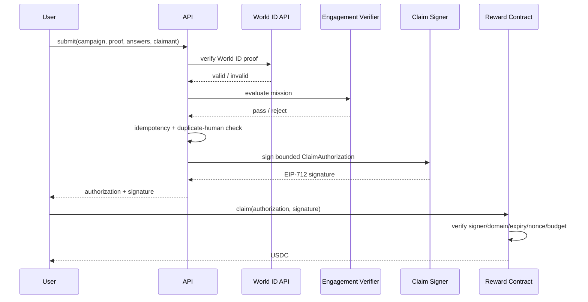

# Claim Authorization Design

> Status: System Design  
> Source decision: ADR-0004

## Purpose

Separate flexible off-chain engagement verification from deterministic on-chain payout.

The backend may decide whether a mission is valid, but it does **not** transfer user funds directly. It issues a bounded authorization that the reward contract verifies.

## Flow



## EIP-712 Type

```solidity
struct ClaimAuthorization {
    uint256 campaignId;
    address claimant;
    uint256 amount;
    bytes32 nonce;
    uint64 expiresAt;
}
```

Suggested type string:

```text
ClaimAuthorization(uint256 campaignId,address claimant,uint256 amount,bytes32 nonce,uint64 expiresAt)
```

## Nonce

Nonce MUST be unique per authorization.

Recommended generation for backend-issued claims:

```
nonce = random 32-byte cryptographically secure value
```

Do not derive nonce solely from timestamp.

## Expiry

POC default: **15 minutes** after issuance.

Reasons:

- limits replay window;
- gives mobile wallet sufficient time;
- authorization can be regenerated idempotently if expired, while ensuring the previous one cannot also be paid.

## Idempotency

Submission endpoint accepts an `Idempotency-Key`.

Same key + same normalized request:

- returns the same submission result;
- MUST NOT create a second financial liability.

Same key + materially different request:

- reject with conflict.

## World ID Data

World ID proof verification and nullifier-related data remain off-chain.

Do not emit raw World ID nullifier data in public contract events.

## Revocation

POC has no per-authorization revocation list.

Risk is bounded by:

- short expiry;
- campaign pause;
- signer rotation;
- budget cap.

Production may add scoped revocation or signer epochs if required.
