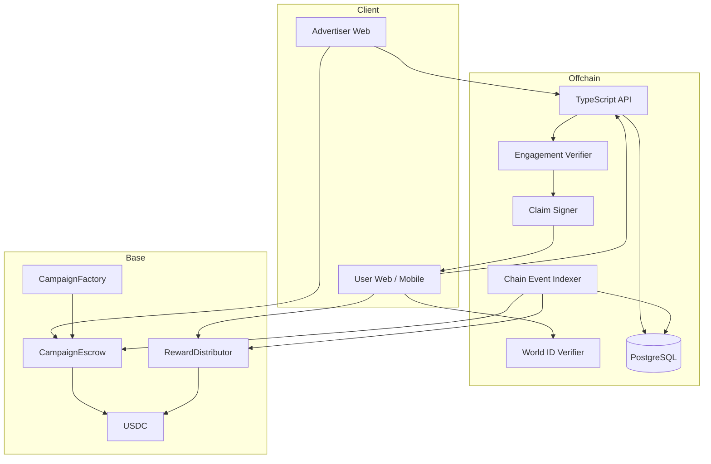
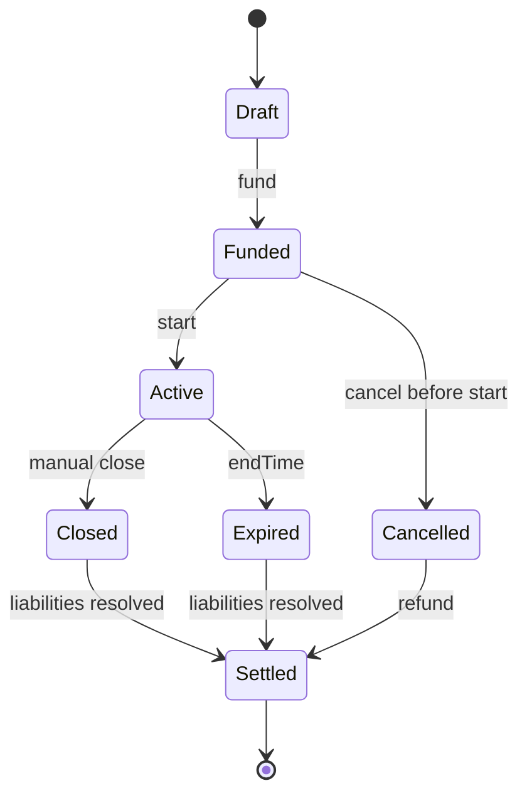

# MVP Architecture / MVP 技術架構

> Status: Initial design  
> Target: POC → MVP

## Architecture



## Proposed Stack

### Web

- Next.js / React
- TypeScript
- wagmi / viem-compatible EVM wallet stack
- World ID external integration

### Backend

- TypeScript
- REST API for initial release
- PostgreSQL
- background event indexer / worker
- structured logs

### Smart Contracts

- Solidity
- Foundry recommended for contract testing/fuzz/invariants
- OpenZeppelin primitives where appropriate

### Chain

- **Base** as proposed POC/MVP default
- USDC settlement
- no bridge in critical path

## Trust Boundary

### On-chain is authoritative for

- funded budget；
- payout；
- refund；
- campaign financial state；
- claim replay protection；
- protocol fee accounting。

### Off-chain is authoritative for POC/MVP

- content availability；
- engagement evaluation；
- comprehension result；
- fraud rules；
- reputation computation；
- analytics metadata；
- issuing claim authorization。

## Claim Model

POC 建議先用 backend-signed claim authorization：

```
Claim {
  campaignId
  claimant
  amount
  nonce
  expiresAt
}
```

Contract 檢查：

1. signer 是否 authorized；
2. signature 是否對應完整 payload；
3. nonce 是否未使用；
4. authorization 是否未過期；
5. campaign 是否允許 claim；
6. budget 是否足夠。

Production 前要重新評估：

- signer compromise blast radius；
- signer rotation；
- multisig / threshold signing；
- campaign-level limits；
- alternative attestation model。

## Campaign State Machine



## Data Model — Initial

### campaigns

- id
- chain_id
- contract_address / campaign_id
- advertiser
- status
- reward_per_completion
- max_completions
- start_at
- end_at
- created_at

### submissions

- id
- campaign_id
- participant_ref
- idempotency_key
- engagement_result
- fraud_status
- claim_nonce
- claim_status
- created_at

### chain_events

- tx_hash
- log_index
- chain_id
- event_name
- payload
- block_number
- confirmation_status

## Failure Rules

### Backend says paid but chain says not paid

Chain wins. Backend reconciles from events.

### Request retry

Must not create duplicate financial liability.

### RPC failure

Do not assume transaction failure merely because RPC timed out; reconcile by tx hash / nonce / events.

### World ID verification unavailable

Fail closed for paid eligibility; do not issue claim.

### Engagement verifier unavailable

Submission remains pending; do not issue claim.

## Deferred Architecture

Not in critical path:

- x402;
- AARC;
- multi-chain settlement;
- publisher SDK;
- advanced reputation;
- ML fraud engine.

These should be integrated after the economic loop is validated.
